# Implement CI/CD Pipelines on Google Cloud: Challenge Lab (GSP393)

Lab ini adalah challenge lab untuk mengimplementasikan CI/CD pipeline menggunakan Google Cloud Deploy dan Artifact Registry. Anda akan berperan sebagai Cloud Engineer untuk Jooli Inc. yang bertugas modernisasi infrastruktur dengan automated integration dan delivery pipelines.

## Skenario Challenge

Sebagai Cloud Engineer baru di Jooli Inc., Anda diminta membuat proof of concept yang mencakup:
- Mengelola Cloud infrastructure dan deployment tools
- Provisioning resources untuk projects
- Implementasi produk dan layanan baru dengan best practices

## 🏗️ Architecture Documentation

Untuk memahami arsitektur lengkap dari lab ini, tersedia dokumentasi visual yang komprehensif:

**Architecture Overview:**
- High-level system design
- Component relationships
- Data flow patterns
- Security model
- Cost analysis

Lihat [Architecture Documentation](architecture/README.md) untuk diagram dan penjelasan lengkap.

## Overview Tasks

1. **PRE-WORK** - Enable APIs, Create GKE clusters dan Docker repository di Artifact Registry
2. **Clone source code**, build image, dan push ke artifact registry
3. **Create delivery pipeline**, targets, dan release
4. **Rebuild dan push image**, tag dengan latest
5. **Create new release** dengan latest version
6. **Promote latest release** ke second cluster
7. **Rollback changes** ke second cluster, modify, dan re-release

---

## Task 1: Prework - Set up Environment, Enable APIs dan Create Clusters

### 1.1 Setup Environment Variables

```bash
export PROJECT_ID=$(gcloud config get-value project)
export PROJECT_NUMBER=$(gcloud projects describe $PROJECT_ID --format='value(projectNumber)')
export REGION=us-east1  # Ganti sesuai region yang diberikan lab
gcloud config set compute/region $REGION
```

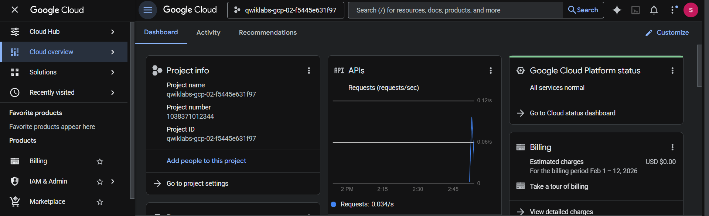

### 1.2 Enable Required APIs

```bash
gcloud services enable \
container.googleapis.com \
clouddeploy.googleapis.com \
artifactregistry.googleapis.com \
cloudbuild.googleapis.com
```

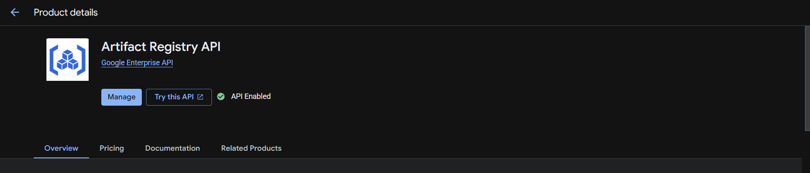

### 1.3 Enable Permissions untuk Kubernetes (GKE) dan Cloud Deploy

```bash
gcloud projects add-iam-policy-binding $PROJECT_ID \
--member=serviceAccount:$(gcloud projects describe $PROJECT_ID \
--format="value(projectNumber)")-compute@developer.gserviceaccount.com \
--role="roles/clouddeploy.jobRunner"

gcloud projects add-iam-policy-binding $PROJECT_ID \
--member=serviceAccount:$(gcloud projects describe $PROJECT_ID \
--format="value(projectNumber)")-compute@developer.gserviceaccount.com \
--role="roles/container.developer"
```

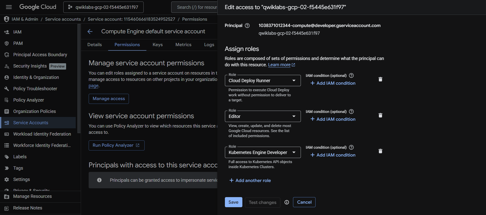

```bash
# Best Practice untuk production
# 1. Buat custom service account (tanpa projectNumber!)
gcloud iam service-accounts create clouddeploy-sa \
  --display-name="Cloud Deploy Runner"

# 2. Berikan roles (gunakan format email custom SA)
gcloud projects add-iam-policy-binding $PROJECT_ID \
  --member="serviceAccount:clouddeploy-sa@$PROJECT_ID.iam.gserviceaccount.com" \
  --role="roles/clouddeploy.jobRunner"

gcloud projects add-iam-policy-binding $PROJECT_ID \
  --member="serviceAccount:clouddeploy-sa@$PROJECT_ID.iam.gserviceaccount.com" \
  --role="roles/container.developer"
```

### 1.4 Create Cloud Storage Bucket

```bash
gsutil mb -p $PROJECT_ID gs://${PROJECT_ID}_cloudbuild
```

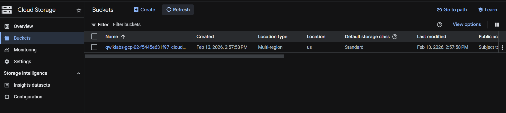

### 1.5 Create Artifact Repository

```bash
gcloud artifacts repositories create cicd-challenge \
--description="Image registry for tutorial web app" \
--repository-format=docker \
--location=$REGION
```

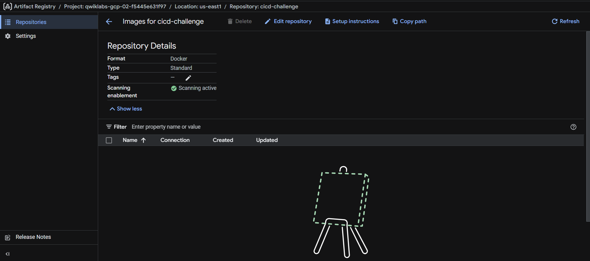

### 1.6 Create GKE Clusters

```bash
gcloud container clusters create cd-staging --node-locations=us-east1-d --num-nodes=1 --async
gcloud container clusters create cd-production --node-locations=us-east1-d --num-nodes=1 --async
```

**Note:** Ganti `us-central1-a` dengan zone yang diberikan di lab

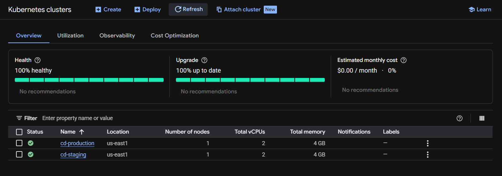

---

## Task 2: Build Images dan Upload ke Repository

### 2.1 Clone Repository

```bash
cd ~/
git clone https://github.com/GoogleCloudPlatform/cloud-deploy-tutorials.git
cd cloud-deploy-tutorials
git checkout c3cae80 --quiet
cd tutorials/base
```

### 2.2 Create Skaffold Configuration

```bash
envsubst < clouddeploy-config/skaffold.yaml.template > web/skaffold.yaml
cat web/skaffold.yaml
```


### 2.3 Build dan Push Container Image

```bash
cd web
skaffold build --interactive=false \
--default-repo us-east1-docker.pkg.dev/qwiklabs-gcp-02-f5445e631f97/cicd-challenge \
--file-output artifacts.json
cd ..
```

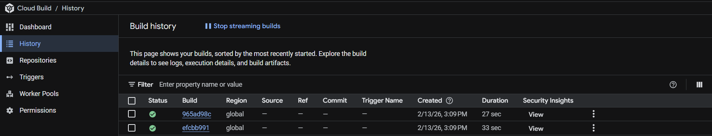

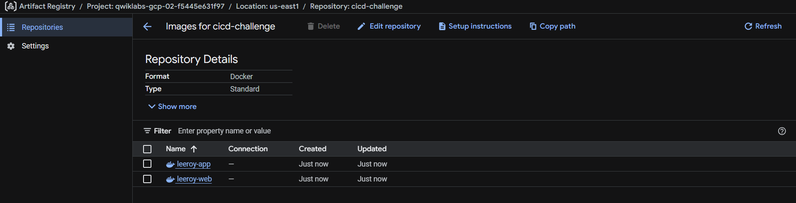

### 2.4 Validate Container Creation

Periksa di Google Cloud Console > Artifact Registry untuk memastikan container image telah dibuat.

---

## Task 3: Create Delivery Pipeline

### 3.1 Copy dan Configure Pipeline Template

```bash
cp clouddeploy-config/delivery-pipeline.yaml.template clouddeploy-config/delivery-pipeline.yaml
sed -i "s/targetId: staging/targetId: cd-staging/" clouddeploy-config/delivery-pipeline.yaml
sed -i "s/targetId: prod/targetId: cd-production/" clouddeploy-config/delivery-pipeline.yaml
sed -i "/targetId: test/d" clouddeploy-config/delivery-pipeline.yaml
```

### 3.2 Set Deployment Region

```bash
gcloud config set deploy/region $REGION
```

### 3.3 Apply Pipeline Configuration

```bash
gcloud deploy apply --file clouddeploy-config/delivery-pipeline.yaml --region=$REGION --project=$PROJECT_ID
```

### 3.4 Verify Delivery Pipeline

```bash
gcloud deploy delivery-pipelines describe web-app --region=$REGION
```

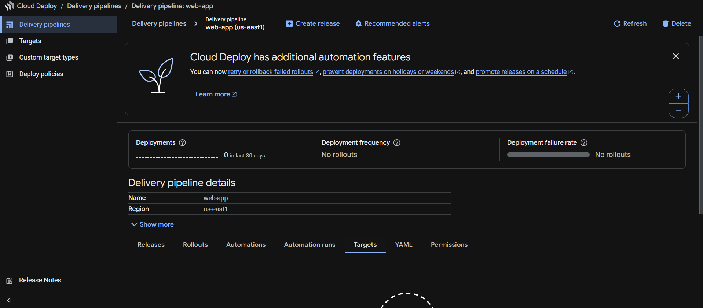

---

## Task 4: Configure Deployment Targets

### 4.1 Verify Clusters Status

```bash
gcloud container clusters list --format="csv(name,status)"
```


Pastikan semua cluster dalam status `RUNNING`.

### 4.2 Create Context untuk Each Cluster

```bash
CONTEXTS=("cd-staging" "cd-production")
for CONTEXT in ${CONTEXTS[@]}
do
    gcloud container clusters get-credentials ${CONTEXT} --region ${REGION}
    kubectl config rename-context gke_${PROJECT_ID}_${REGION}_${CONTEXT} ${CONTEXT}
done
```

### 4.3 Create Namespace di Each Cluster

```bash
for CONTEXT in ${CONTEXTS[@]}
do
    kubectl --context ${CONTEXT} apply -f kubernetes-config/web-app-namespace.yaml
done
```

### 4.4 Create Target Definition Files

```bash
envsubst < clouddeploy-config/target-staging.yaml.template > clouddeploy-config/target-cd-staging.yaml
envsubst < clouddeploy-config/target-prod.yaml.template > clouddeploy-config/target-cd-production.yaml

sed -i "s/staging/cd-staging/" clouddeploy-config/target-cd-staging.yaml
sed -i "s/prod/cd-production/" clouddeploy-config/target-cd-production.yaml
```

### 4.5 Apply Target Files

```bash
gcloud deploy apply --file clouddeploy-config/target-cd-staging.yaml --region=$REGION --project=$PROJECT_ID
gcloud deploy apply --file clouddeploy-config/target-cd-production.yaml --region=$REGION --project=$PROJECT_ID
```


### 4.6 Display Staging Target Details

```bash
cat clouddeploy-config/target-cd-staging.yaml
```

### 4.7 Verify Cloud Deploy Targets

```bash
gcloud deploy targets list --region=$REGION
```

---

## Task 5: Create a Release

### 5.1 Create Release


### 5.2 Verify Release ke Staging Environment

```bash
gcloud deploy rollouts list \
--delivery-pipeline web-app \
--release web-app-001 \
--region=$REGION
```

---

## Task 6: Promote Application ke Production

### 6.1 Promote Release

```bash
gcloud deploy releases promote \
--project=$PROJECT_ID \
--region=$REGION \
--delivery-pipeline=web-app \
--release=web-app-001
```

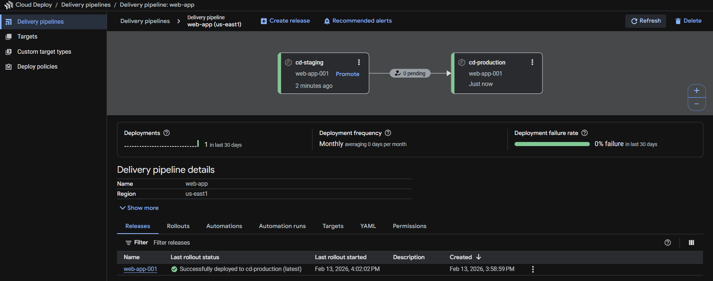

### 6.2 Approve Deployment 

Buka Google Cloud Console > Cloud Deploy untuk approve deployment ke production.

### 6.3 Verify Release ke Production Environment

```bash
gcloud deploy rollouts list \
--delivery-pipeline web-app \
--release web-app-001 \
--region=$REGION
```

---

## Task 7: Make Changes dan Redeploy

### 7.1 Modify Application Code

Edit file `cloud-deploy-tutorials/tutorials/base/web/leeroy-web/web.go`:

### 7.2 Build dan Push New Version

```bash
cd web
skaffold build --interactive=false \
--default-repo us-east1-docker.pkg.dev/qwiklabs-gcp-02-f5445e631f97/cicd-challenge \
--file-output artifacts.json
cd ..
```


### 7.3 Create New Release

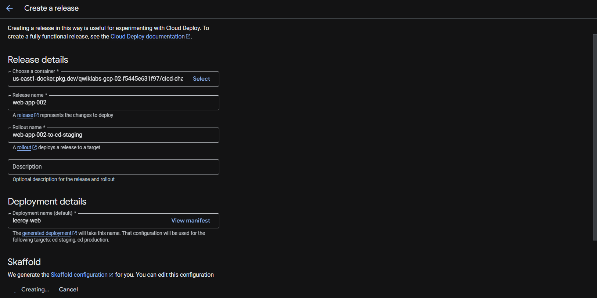

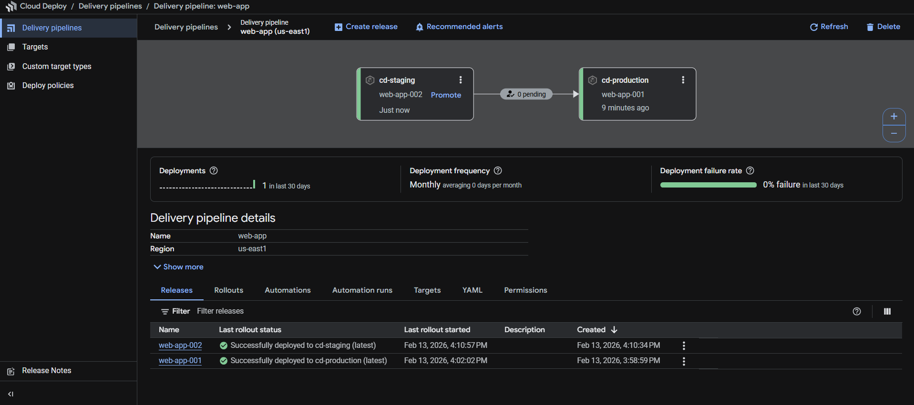

### 7.4 Verify New Version di Staging

```bash
gcloud deploy rollouts list \
--delivery-pipeline web-app \
--release web-app-002 \
--region=$REGION
```

---

## Task 8: Rollback Changes

### 8.1 Rollback ke Previous Version

```bash
gcloud deploy targets rollback cd-staging \
--project=$PROJECT_ID \
--region=$REGION \
--delivery-pipeline=web-app \
--release=web-app-001
```

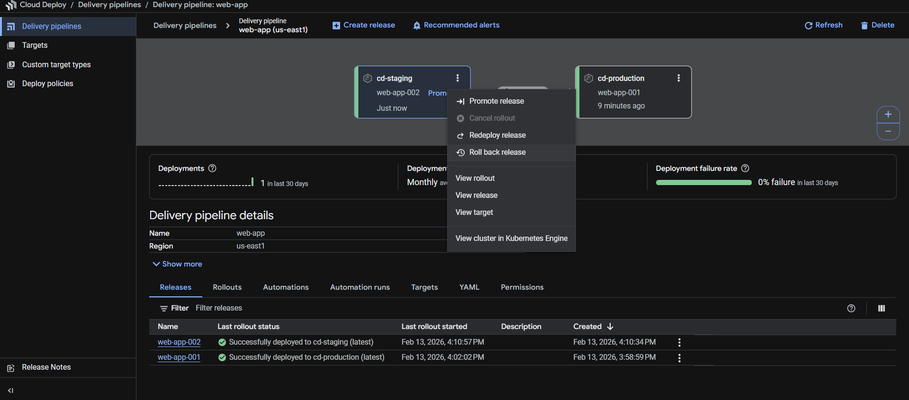

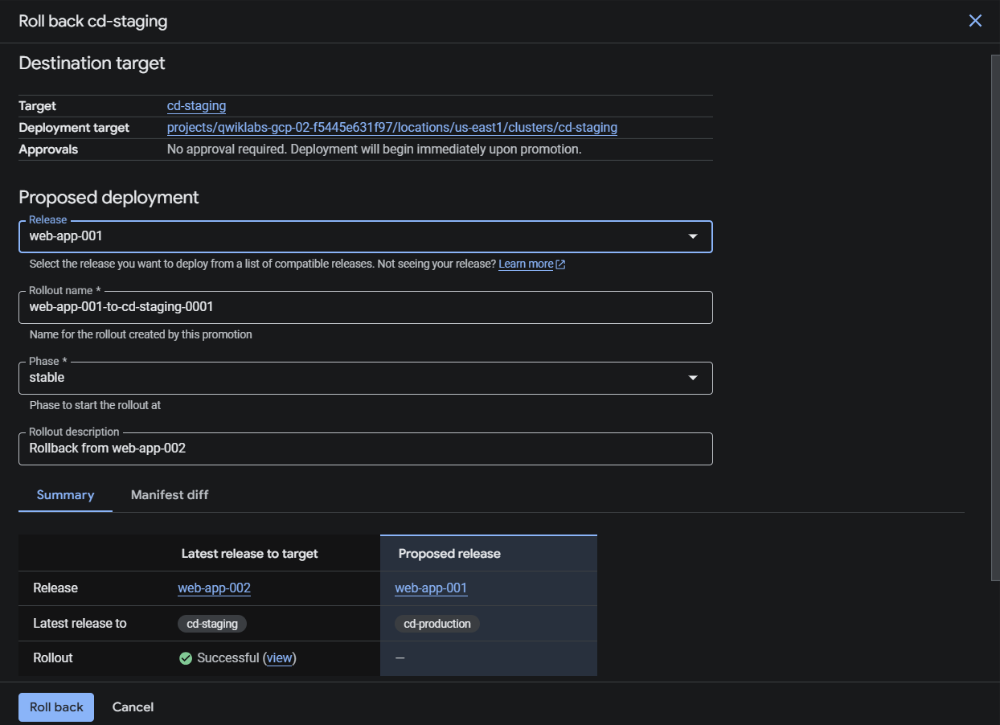

### 8.2 Verify Rollback Success

```bash
gcloud deploy rollouts list \
--delivery-pipeline web-app \
--release web-app-001 \
--region=$REGION
```

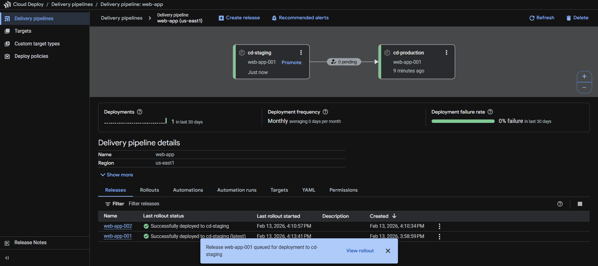

---

## Tips untuk Challenge Lab

1. **Perhatikan naming convention** - gunakan nama yang tepat sesuai instruksi
2. **Ganti placeholder values** - seperti region, zone, dan project ID
3. **Tunggu cluster ready** sebelum melanjutkan ke step berikutnya
4. **Check progress** di Google Cloud Console untuk memastikan setiap step berhasil
5. **Read error messages** dengan teliti jika ada yang gagal

## Resources

- [Cloud Deploy Documentation](https://cloud.google.com/deploy/docs)
- [Artifact Registry Documentation](https://cloud.google.com/artifact-registry/docs)
- [GKE Documentation](https://cloud.google.com/kubernetes-engine/docs)
- [Skaffold Documentation](https://skaffold.dev/docs/)

---
